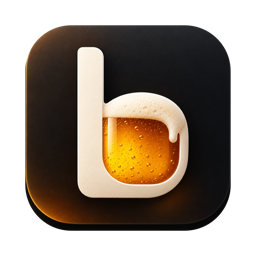
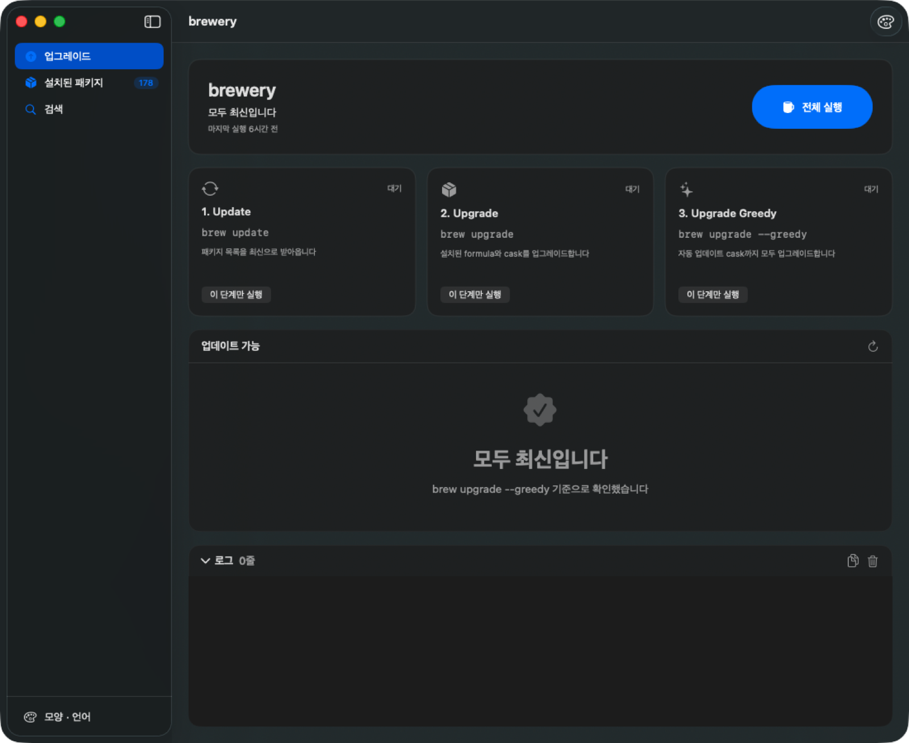
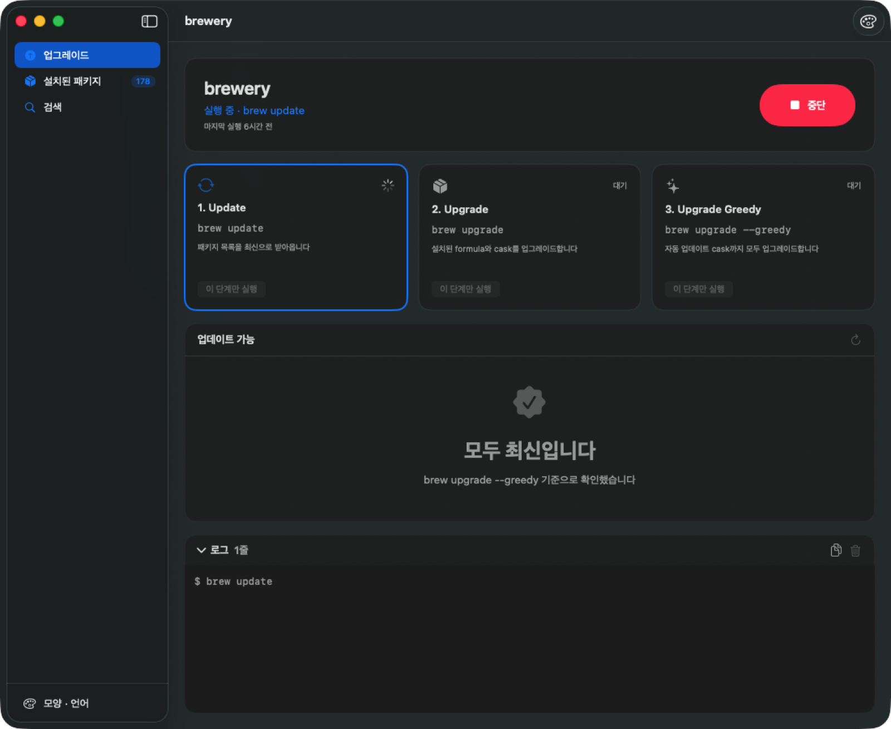
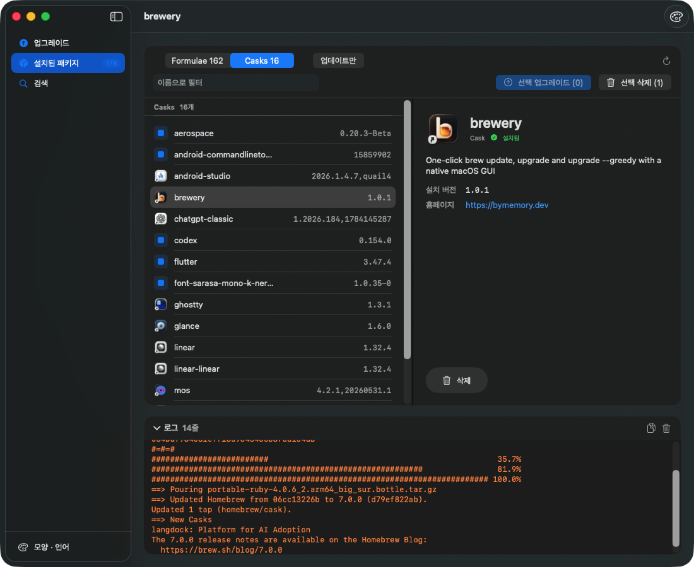
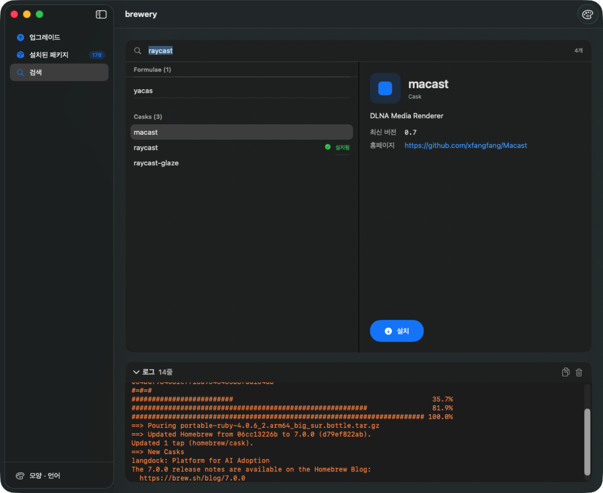
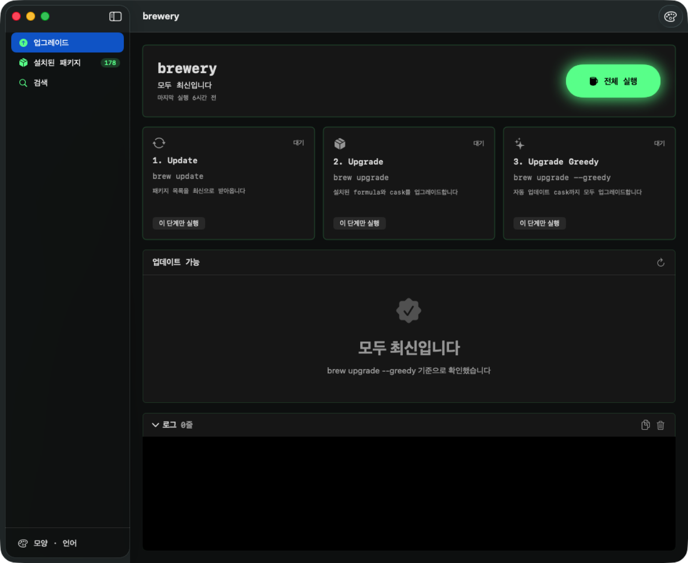
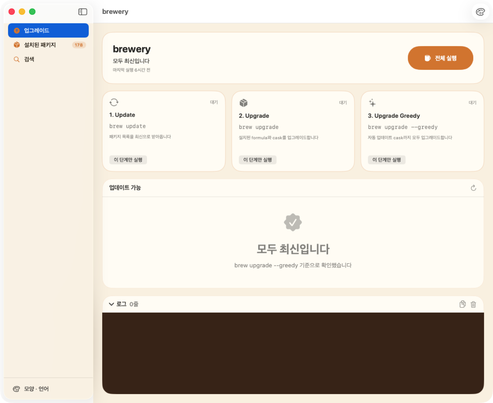

<p align="center">
  
</p>

<h1 align="center">brewery</h1>

<p align="center">
  <b>Homebrew를 버튼 하나로.</b><br>
  <code>brew update</code> → <code>brew upgrade</code> → <code>brew upgrade --greedy</code> 를 클릭 한 번에 실행하는 macOS 네이티브 앱.
</p>

<p align="center">
  <a href="https://github.com/Devguru-J/brewery/releases/latest"></a>
  
  
  
  <a href="LICENSE"></a>
</p>

<p align="center">
  <a href="#설치">설치</a> ·
  <a href="#기능">기능</a> ·
  <a href="#테마">테마</a> ·
  <a href="#빌드">빌드</a> ·
  <a href="#english">English</a>
</p>

---

매일 터미널을 열어 같은 세 줄을 치고 있었습니다. brewery는 그 세 줄을 버튼 하나로 바꾸고, 지금 뭐가 설치돼 있고 뭐가 업데이트됐는지 한눈에 보여줍니다.

<p align="center">
  
</p>

## 설치

```bash
brew install --cask devguru-j/tap/brewery
```

또는 [Releases](https://github.com/Devguru-J/brewery/releases/latest)에서 zip을 받아 Applications 폴더에 넣으세요. Developer ID로 서명하고 Apple 공증을 거친 빌드라 경고 없이 바로 열립니다.

## 기능

### 전체 실행, 또는 한 단계씩

큰 버튼 하나가 update → upgrade → upgrade --greedy 를 순서대로 돌립니다. 한 단계가 실패하면 거기서 멈추고 카드가 빨갛게 바뀝니다. 각 단계는 따로 실행할 수도 있고, 실행 중에는 언제든 중단할 수 있습니다. brew의 출력은 하단 로그에 실시간으로 흐릅니다.

<p align="center">
  
</p>

### 설치된 패키지

Formulae와 Casks를 탭으로 나눠 보여줍니다. Cask는 실제 설치된 앱의 아이콘을 그대로 표시합니다. 항목을 고르면 설명, 설치 버전, 홈페이지가 오른쪽에 나오고, 업데이트가 있으면 `현재 → 새 버전`과 함께 배지가 붙습니다.

- 여러 개를 선택해 **골라서 업그레이드**하거나 **골라서 삭제**합니다. 삭제는 항상 확인창을 거칩니다.
- "업데이트만" 필터로 업데이트가 있는 것만 추립니다.

<p align="center">
  
</p>

### 검색해서 설치

`brew search` 결과를 formula와 cask로 나눠 보여줍니다. 이미 설치된 항목은 표시되고, 하나를 고르면 설명과 최신 버전, 홈페이지를 확인한 뒤 설치 버튼을 누르면 됩니다.

<p align="center">
  
</p>

### 메뉴바

메뉴바의 맥주잔 아이콘에 업데이트 가능 개수가 표시됩니다. 클릭하면 작은 패널에서 바로 전체 실행을 누르거나 창을 열 수 있습니다. 창을 닫아도 메뉴바에 남아 있습니다.

### 7개 언어

기본은 Mac의 시스템 언어를 따릅니다. 한국어, English, 日本語, 简体中文, Español, Deutsch, Français 중 원하는 언어를 고르면 재시작 없이 바로 바뀝니다.

## 테마

툴바의 팔레트 버튼, 사이드바 아래 "모양 · 언어", 설정(⌘,) 어디서든 바꿀 수 있습니다.

| macOS 순정 (기본) | 다크 터미널 | 맥주집 |
|:---:|:---:|:---:|
|  |  |  |
| 시스템 재질과 SF Symbols | 검정 바탕, 초록 글씨, 글로우 | 호박색 팔레트와 거품 |

## 알아둘 점

- 관리자 비밀번호가 필요한 cask는 GUI에서 입력받을 수 없어 실패로 표시됩니다. 로그에 안내가 나오니 그 항목만 터미널에서 실행하세요.
- 변경 내역(changelog)은 brew가 제공하지 않습니다. 상세 패널의 홈페이지 링크에서 릴리스 노트를 확인하세요.
- 삭제는 강제 옵션 없이 실행됩니다. 다른 패키지가 의존하는 formula는 brew가 거부하고 이유를 로그에 남깁니다.
- Mac App Store에는 올릴 수 없습니다. 샌드박스 안에서는 brew를 실행할 수 없기 때문입니다.

## 빌드

Xcode 15 이상과 [xcodegen](https://github.com/yonaskolb/XcodeGen)이 필요합니다. 외부 패키지 의존성은 없습니다.

```bash
brew install xcodegen
xcodegen generate
xcodebuild -scheme brewery -destination 'platform=macOS' -derivedDataPath build build
open build/Build/Products/Debug/brewery.app
```

테스트:

```bash
xcodebuild -scheme brewery -destination 'platform=macOS' -derivedDataPath build test
```

### 릴리스

```bash
scripts/release.sh 1.0.1      # Release 빌드 → 서명 → 공증 → 스테이플 → zip + sha256
gh release create v1.0.1 build/release/brewery-1.0.1.zip build/release/brewery-1.0.1.zip.sha256
scripts/bump-cask.sh 1.0.1    # tap 저장소의 버전·sha256 갱신
```

서명·공증에는 키체인의 "Developer ID Application" 인증서와 공증 프로필(`brewery-notary`)이 필요합니다.

### 번역

문자열은 `Resources/Localizable.xcstrings` 한 곳에 있고 코드에서는 `L("키")`로 읽습니다. 새 언어는 xcstrings에 추가한 뒤 `Sources/Theme/Localization.swift`의 `options`와 `project.yml`의 `CFBundleLocalizations`에 코드를 넣으면 됩니다.

### 앱 아이콘

원본은 `assets/brewery_app_icon.png`입니다. 바꾸려면 새 이미지를 같은 자리에 두고 아래를 실행하세요.

```bash
swift scripts/fit-icon.swift assets/brewery_app_icon.png /tmp/icon-1024.png
for s in 16 32 64 128 256 512 1024; do
  sips -z $s $s /tmp/icon-1024.png --out Resources/Assets.xcassets/AppIcon.appiconset/icon_$s.png
done
```

## 구조

```
Sources/
  Engine/    brew 실행(Process 스트리밍), 파서, 파이프라인 상태, 설치·삭제·업그레이드
  Models/    Step, OutdatedPackage, InstalledPackage, PackageInfo
  Theme/     테마 3종, 로컬라이즈
  Views/     SwiftUI 화면
Resources/   String Catalog, 아이콘, About 크레딧
Tests/       파서·러너·파이프라인 단위 테스트
```

---

## English

**brewery** is a native macOS app that runs `brew update` → `brew upgrade` → `brew upgrade --greedy` with one click, and shows what's installed, what's outdated, and what you can install.

```bash
brew install --cask devguru-j/tap/brewery
```

- **Run all or step by step.** One big button runs the three commands in order and stops on failure. Each step can run alone; output streams into a live log.
- **Installed packages.** Formulae and casks in separate tabs, real app icons for casks, description / version / homepage, update badges with `current → new`. Multi-select to upgrade or delete only what you choose.
- **Search & install.** `brew search` results split by kind, with details and a one-click install.
- **Menu bar.** Outdated count in the menu bar, quick "Run All" from a popover.
- **3 themes, 7 languages.** macOS native / dark terminal / taproom. Follows your system language; switch instantly to ko, en, ja, zh-Hans, es, de, fr.
- Signed with Developer ID and notarized by Apple. Requires macOS 14+.

Not on the Mac App Store because the sandbox can't run `brew`.

---

<p align="center">
  Made by <b>Memory(기억)</b> · <a href="https://bymemory.dev">bymemory.dev</a> · MIT License
</p>
